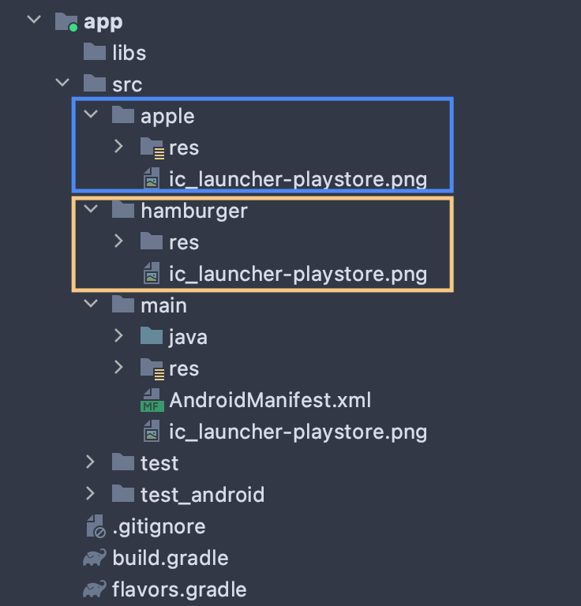

# Cómo crear una marca blanca (flavor) de una app


## ¿Para qué sirve un flavor?
En pocas palabras, con los flavors puedes clonar una app existente, y modificar ciertos aspectos de una forma muy sencilla.

Por ejemplo, puede crear dos aplicaciones exactamente iguales, pero con diferentes colores, nombre e iconos. Por lo que parecerá una aplicación diferente.


## ¿Qué puedo modificar creando un flavor?
* Datos básicos de la aplicación (`packageId`, `versionCode`, `versionName`)
* Sobrescribir recursos (`strings`, `colors`, `drawable`, `fonts`, ...)
* Usar un fichero `google-services.json` por cada flavor
* Constantes (y variables) en función del buildType (release o debug)


## Ok, me has convencido, ¿por dónde empiezo?
Creamos un fichero llamado `flavors.gradle` (por ejemplo), y lo importamos a nuestro `build.gradle (app)`:
```
plugins {
    ...
}

// añadimos esta linea después de los plugins
apply from: 'flavors.gradle'

android {
    ...
}

dependencies {
    ...
}
```
De esta forma, tenemos los siguientes ficheros:
* `build.gradle`: contiene la configuración genérica de la apps.
* `flavors.gradle`: contiene configuración avanzada de cada flavor.


## Vamos a declarar un flavor
### 1. Estructura
Todos los flavors que creemos estarán dentro de un bloque llamado `productFlavor` que a su vez estará dentro del bloque raíz `android`.

`flavors.gradle`:
```
android {

    productFlavor {

        main {
            // configuración de nuestro código básico
        }

        apple {
            // configuración de un flavor llamado apple
        }

        hamburger {
            // configuración de un flavor llamado hamburger
        }
    }
}
```

### 2. Datos básicos:
En cada flavor, podemos definir el package name, la versión y el nombre de la versión:
```
apple {
    flavorDimensions 'app'
    applicationId 'io.cpalosrejano.flavor.apple'
    versionName '1.0.1'
    versionCode 2
    ...
}
```


### 3. Localización de directorios:
Ahora vamos a definir los directorios raiz donde estarán los recursos de nuestro flavor.





Por ejemplo, podemos sobrescribir `app_name` en el fichero `strings.xml` para cambiar el nombre a nuestra app.
Si no sobrescribes recursos (colors.xml, strings.xml, etc...), el flavor utilizará los recursos por defecto establecidos en el proyecto principal (`/src/main/`)

Para definir el directorio de nuestro flavor, utilizaremos un bloque `sourceSets`, y dentro creamos otro bloque con el nombre de nuestro flavor.
```
apple {
    ...
    sourceSets {
        apple {
            res.srcDirs = ['src/apple/res']
        }
    }
}
```

### 4. Campos de configuración
Creamos las constantes que utilizaremos en nuestras app para customizar cada flavor.

Por ejemplo, podemos crear una API_URL para el entorno de desarrollo y otra para el entorno de producción (en el siguiente punto veremos como obtenerlas sin ensuciar demasiado nuestro código.)
```
apple {
    ...
    buildConfigField 'String', 'API_URL',           '"http://apple.io/"'
    buildConfigField 'String', 'API_URL_DEBUG',     '"http://dev.apple.io/"'
    
    buildConfigField 'String', 'API_KEY',           '"ipsum"'
    buildConfigField 'String', 'API_KEY_DEBUG',     '"lorem"'
}
```

### 5. Obteniendo campos de configuración del ¿`BuildConfigFlavor`?:
¿Cómo puedo obtener mi url de desarrollo si estoy estoy probando en modo debug y mi url de producción si estoy en modo release?. Lo normal sería comprobar con `BuildConfig.DEBUG` en cada sitio que necesitemos diferenciar debug y release, y en función de si es true o false, establecer el valor de una constante u otra:
```
val apiUrl: String
val apiKey: String

if (BuildConfig.DEBUG) {
    apiUrl = BuildConfig.API_URL_DEBUG
    apiKey = BuildConfig.API_KEY_DEBUG
} else {
    apiUrl = BuildConfig.API_URL
    apiKey = BuildConfig.API_KEY
}
```
Como habrás adivinado, esto puede ensuciar y engordar nuestro código. Y, ¿cómo lo mejoramos? Creando un wrapper (yo lo he llamado `BuildConfigFlavor`):
```
object BuildConfigFlavor {

    val apiKey: String
    val apiUrl: String
    // ...

    init {
        if (BuildConfig.DEBUG) {
            apiKey = BuildConfig.API_KEY_DEBUG
            apiUrl = BuildConfig.API_URL_DEBUG
            // ...
        } else {
            apiKey = BuildConfig.API_KEY
            apiUrl = BuildConfig.API_URL
            // ...
        }
    }
}
```
De esta forma encapsulamos la lógica del valor de nuestras constantes, en función de si se ha compilado en modo debug o en modo release. Vale, requiere un esfuerzo extra al inicio, pero ganamos legibilidad del código:

```
val apiUrl = BuildConfigFlavor.apiUrl
val apiKey = BuildConfigFlavor.apiKey
```


## Resultado final 
Más o menos, quedará así nuestra configuración:

 `flavors.gradle`:
```
android {

    productFlavors {

        apple {
            flavorDimensions 'app'
            applicationId 'io.cpalosrejano.flavor.apple'
            versionName '1.0.1'
            versionCode 2

            sourceSets {
                apple {
                    res.srcDirs = ['src/apple/res']
                }
            }

            // WARNING: USE AND CONFIGURE THESE FIELDS FROM BuildConfigFlavor
            buildConfigField 'String', 'EMAIL',             '"hello@apple.io"'
            buildConfigField 'String', 'API_URL',           '"http://apple.io/"'
            buildConfigField 'String', 'API_URL_DEBUG',     '"http://dev.apple.io/"'
            buildConfigField 'String', 'API_KEY_DEBUG',     '"lorem"'
            buildConfigField 'String', 'API_KEY',           '"ipsum"'
        }
    }
}
```

`BuildConfigFlavor`:
```
object BuildConfigFlavor {

    val email: String
    val apiKey: String
    val apiUrl: String

    init {
        if (BuildConfig.DEBUG) {
            email = BuildConfig.EMAIL
            apiKey = BuildConfig.API_KEY_DEBUG
            apiUrl = BuildConfig.API_URL_DEBUG
            
        } else {
            email = BuildConfig.EMAIL
            apiKey = BuildConfig.API_KEY
            apiUrl = BuildConfig.API_URL
        }
    }
}
```

`NetworkConfiguration.kt`
```
...
    val apiUrl = BuildConfigFlavor.apiUrl
    val apiKey = BuildConfigFlavor.apiKey
...
```


